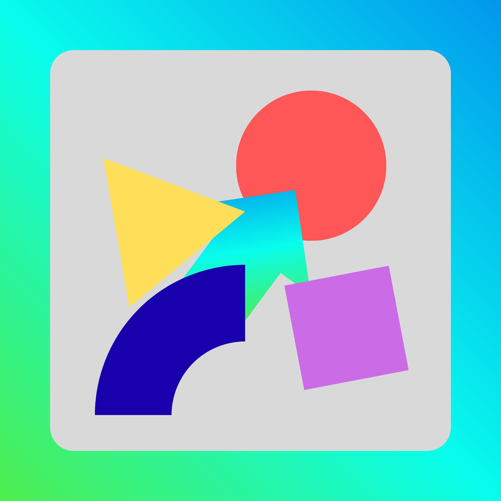

# ⚡ HEYgent

**Your local AI software engineer.** HEYgent builds, runs, and debugs code for you — no terminal knowledge required.



---

## What it does

HEYgent is a desktop app powered by AI that can:

- 📁 **Create and edit files** in a sandboxed workspace
- 🔧 **Run code** — Python, Node.js, bash, anything
- 🌐 **Preview web apps** live inside the app
- 💻 **Multiple terminals** — run frontend and backend simultaneously
- 🔍 **Browse the web** to research and solve problems
- 🗂️ **View your files** — click any file in the sidebar to read and copy the code

You just describe what you want. HEYgent writes the code, runs it, fixes errors, and shows you the result.

---

## Requirements

- macOS (Apple Silicon or Intel)
- [Node.js](https://nodejs.org) v18 or higher
- An API key from one of:
  - **[Ollama](https://ollama.com/settings/api-keys)** (MiniMax M2.5 — primary)
  - **[OpenRouter](https://openrouter.ai/keys)** (Trinity Large — free fallback)

---

## Installation

### Option 1 — Download the app (easiest)

1. Go to [Releases](../../releases) and download the latest `.zip`
2. Unzip and open `HEYgent.app`
3. On first launch, enter your API key

### Option 2 — Run from source

```bash
# Clone the repo
git clone https://github.com/TU_USUARIO_GITHUB/HEYgent.git
cd HEYgent

# Install backend dependencies
cd backend && npm install && cd ..

# Install frontend dependencies and build
cd frontend && npm install && npm run build && cd ..

# Add your API keys
cp .env.example .env
# Edit .env and add your keys

# Start the app
cd backend && node server.js
# In another terminal:
cd frontend && npm run dev
# Open http://localhost:5173
```

### Option 3 — Build the .app yourself

```bash
git clone https://github.com/TU_USUARIO_GITHUB/HEYgent.git
cd HEYgent

cd backend && npm install && cd ..
cd frontend && npm install && npm run build && cd ..

npm install
npx electron-forge make

# App will be in out/HEYgent-darwin-arm64/HEYgent.app
```

---

## Setup

1. Open HEYgent
2. On first launch you'll see the **welcome screen** — paste your API key
3. Start chatting — describe what you want to build

**Where to get API keys:**
- Ollama (MiniMax): [ollama.com/settings/api-keys](https://ollama.com/settings/api-keys)
- OpenRouter (free): [openrouter.ai/keys](https://openrouter.ai/keys) — enable "Allow free models" in privacy settings

---

## Usage examples

> *"Build a to-do app with a clean UI and run it on localhost"*

> *"Create a Python script that downloads YouTube thumbnails and save it to workspace"*

> *"Look at my calculator.py and add keyboard support"*

> *"Build a REST API in Node.js with endpoints for users and products"*

---

## How it works

```
You → Chat → AI Agent → Tools → Workspace
                  ↓
          write_file / run_command / browser_search
                  ↓
          Results stream back to chat
```

HEYgent runs a local Node.js backend that connects to cloud AI models. All files are sandboxed to the `workspace/` folder. Nothing leaves your machine except API calls.

---

## Project structure

```
HEYgent/
├── backend/
│   ├── server.js          # Express + WebSocket server
│   ├── agent.js           # AI agent loop
│   └── tools/
│       ├── filesystem.js  # Sandboxed file operations
│       ├── terminal.js    # Multi-session terminal
│       └── browser.js     # Playwright browser control
├── frontend/
│   └── src/
│       ├── App.jsx
│       └── components/
│           ├── ChatPanel.jsx
│           ├── Sidebar.jsx
│           ├── SidePanel.jsx   # Terminals + Preview
│           └── Onboarding.jsx
├── workspace/             # AI sandbox (your files live here)
├── main.js                # Electron entry point
└── forge.config.js        # Electron Forge config
```

---

## License

MIT — free to use, modify, and distribute.

---

Built with ❤️ using MiniMax M2.5 · OpenRouter · Electron · React · Node.js
